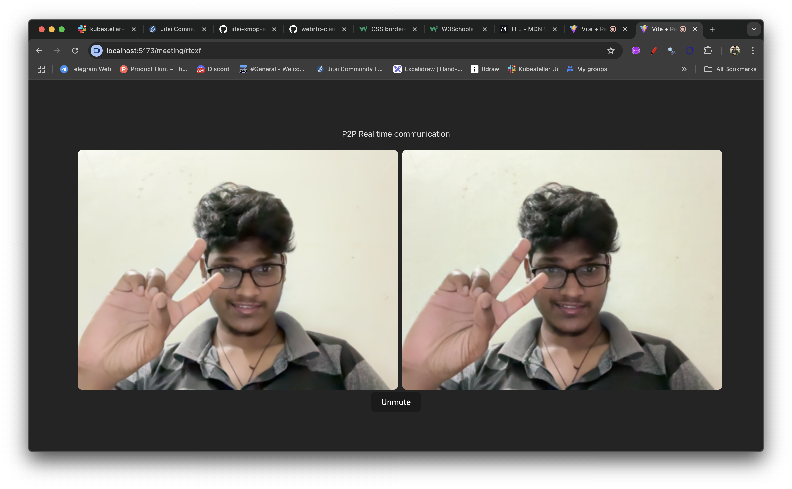

> From inside `p2p-client` , do npm install and then run `npm run dev` 

> Clone the signaling server project - [Backend which act as Signaling Server for this application](https://github.com/manzil-infinity180/webrtc_server), do npm install and then run `npm run dev` - the server is running on port `5006` 

> Do some fun by visiting `localhost:5173` our frontend 
 

Thanks,
Rahul